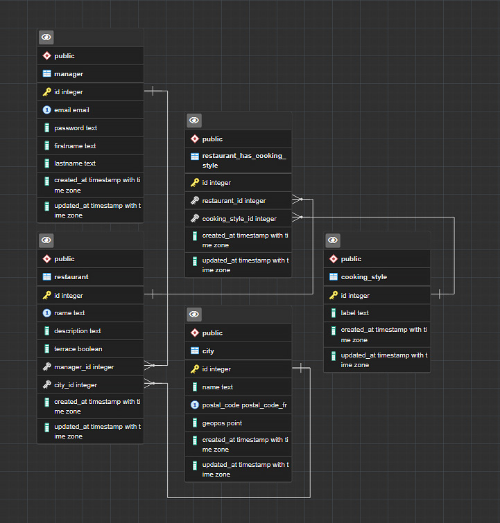

# GraphQL (Apollo Server)

## Introduction

[Ressource Tech-wiki](https://tech-wiki.online/fr/apollo.html#:~:text=Apollo%20Server%20est%20une%20impl%C3%A9mentation,charge%20de%20nombreux%20frameworks%20Node.)

[GraphQL](https://graphql.org/)

[Apollo Server](https://www.apollographql.com/docs/apollo-server/)

Un serveur GraphQL (SDL: Schema Definition Language) a pour tâche d'accepter les demandes entrantes sur un point de terminaison, d'interpréter la demande et de rechercher toutes les données nécessaires pour répondre aux besoins du client. GraphQL est une alternative au REST API.

Apollo Server est une implémentation de serveur GraphQL pour JavaScript, en particulier pour en cas d'utilisation de Node.js et d'express.

Il prend en charge de nombreux frameworks Node.js populaires, notamment:

    - Express
    - Hapi
    - Koa
    - Restifier


### Comparaison entre une API RESTful et une API GraphQL (Apollo)
Ressource O'clock

|REST 📋|GraphQL 🧬|
|:-:|:-:|
|<u>-- **À mettre en place** --</u>||
|Connecteur de DB|Connecteur de DB|
|Model|Model|
|Controller|Resolver|
|Logger|Logger|
|JWT|JWT|
|<u>-- **Généré par le schéma GraphQL** --</u>||
|Validation|-|
|Route|-|
|Doc Swagger|-|
|<u>-- **Intégré par Apollo** --</u>||
|Exception|-|
|Error Handler|-|

Le schéma GraphQL centralise beaucoup de fonctionnalités, qui devrait être gérées manuellement par une API RESTful.

Les avantages d'Apollo Server :

- Nous donne un moyen de décrire nos données avec un schéma.
- Fournit un cadre avec les résolveurs. (Equivalent au Controller (REST API))
- Facilite la manipulation d'authentification pour notre API. (JSON WEB TOKEN (JWT))
- Utilisation de :
  - DataSource permet d'envoyer des requêtes au différents endpoints
  - DataLoader effectue la mise en cache des requêtes faite à notre BDD

[Apollo Blog DataSource](https://www.apollographql.com/blog/backend/data-sources/a-deep-dive-on-apollo-data-sources/)

Voici les bibliothèques de sources de données open source officielles et gérées par la communauté :

[RESTDataSource](https://www.apollographql.com/docs/apollo-server/data/data-sources/#rest-data-source) : Récupère les données d'une API REST. Cache-ControlInclut la mise en cache basée sur les méthodes d'en-tête et de cycle de vie de la réponse HTTP .

[SQLDataSource](https://github.com/cvburgess/SQLDataSource) : Récupère les données d'une base de données SQL. Inclut la mise en cache des requêtes SQL Knex .

[MongoDataSource](https://github.com/GraphQLGuide/apollo-datasource-mongodb/) : Récupère les données d'une base de données MongoDB. Inclut la mise en cache et le traitement par lots lors de la récupération d'objets par ID.

[GraphQLDataSource](https://github.com/poetic/apollo-datasource-graphql) : Récupérez des données en vous approvisionnant à partir d'une API GraphQL existante .


## Sommaire :

- Initialisation du projet
- Installation des packages
- Mise en place de l'architecture
- Initialisation sqitch
- Mise en place de notre config initial de notre API


## Initialisation du projet
- Initialisation du projet
 
      - npm init -y

## Installation des packages
- Tous les packages pour le projet:

       - npm i express dotenv pg debug @faker-js/faker
       - npm i apollo-server apollo-server-express apollo-datasource-rest datasource-sql dataloader graphql-scalars 

## Mise en place de l'architecture (dossier)

- _docs
- app
  - datamappers
    - 
  - datasources
    - 
  - resolvers
    - 
  - schemas
    - tables
  - services
  - utils
- data
  - migrations
    - deploy
    - revert
    - verify


## MCD
## MLD
## MPD




## Initialisation sqitch / création de la BDD

## Insérer les données faker

Attention, pour le seeding, on utilise les informations de connexion venant de notre fichier `pg.js` qui à son tour utilise les variables d'environnement stockées dans le fichier `.env`.

Afin de lancer le fichier `seeding.js` pour le remplissage de nos tables, il ne faudra pas oublier de se positionner là où le fichier `.env` se trouve et on peut alors rentrer la commande 

`node data/seeding.js`

Dans notre cas, on va chercher le fichier dans `data`.

Sinon on aura une erreur de ce type :
```
error: la relation « manager » n'existe pas
```

## Config initial de notre API

Dans package.json:
Création de scripts "start" et "dev" ainsi que l'utilisation du type ES6

Mise en place du DEBUGGER

  - mettre `DEBUG=*` dans le .env
  - Ou `DEBUG=EntryPoint,nomVariables2,nomVariables3
  - Importation ES6

```js
//~ ---------- LOGGER
import debug from 'debug';
const logger = debug('EntryPoint');
//exemple d'utilisation
logger('Lancement du server');
```

Dans index.js:

```js

//~ ---------- VARIABLES D'ENVIRONNEMENT
import 'dotenv/config';

//~ ---------- IMPORTATION HTTP
import * as createServer from 'http';

//~ ---------- IMPORTATION APPOLOSERVER (GraphQL)
import pkg from 'apollo-server';
const { ApolloServer } = pkg;

//~ ---------- EXPRESS
import express from 'express';
const app = express();

//~ ---------- LOGGER
import debug from 'debug';
const logger = debug('EntryPoint');
logger('-------------------- Lancement du server -------------------- ')
//~ ---------- 

//~ ---------- IMPORTATION SCHEMA AND RESOLVERS WITH CONFIG
import { apolloConfig } from './app/index.js';
const server = new ApolloServer(apolloConfig);

//~ ---------- PORT
const PORT = process.env.PORT ?? 3000;


//~ ---------- START APOLLO SERVER
async function startServer() {
    //Start instance Apollo Server
      await server.start();
    // Link Express with Apollo server
      server.applyMiddleware({app});
    
        await app.listen(PORT);
        logger(`🚀 Server launched on http://localhost:${PORT}`);
    };
    
    startServer();

logger('------------------------------------------------------------- ')

```

En cours...
<!-- TODO : JEST + MUTATION -->
